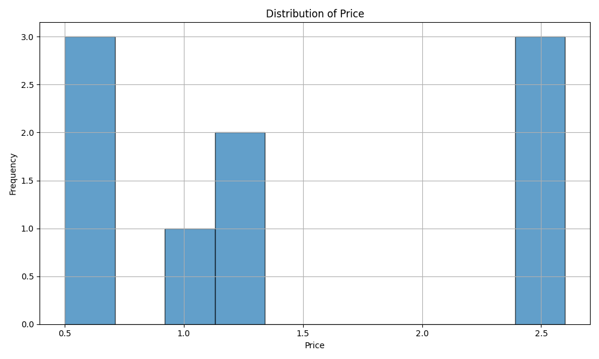

# indiv_proj1_yx248

This project is a comprehensive example of leveraging Continuous Integration using GitHub Actions for a Python Data Science project. Building upon the foundation of structured project directories and workflows, the main aim is to compute descriptive statistics using the Pandas (or Polars) library and visualize data distribution. Additionally, with the integration of GitHub Actions, we ensure that code health is maintained by running tests, linting, and formatting automatically on every push or pull request.

## Overview

The project is structured with separate scripts for data processing, shared library functions, and Jupyter notebooks for interactive data exploration.

## Key Modifications from Original Template

- Utilization of the Polars/Pandas library for efficient and robust data processing.
- Continuous Integration with GitHub Actions, ensuring code quality and health.
- Shared codebase (lib.py) for both script and Jupyter notebook, promoting code reusability and consistency.

### Requirements

For a complete list, refer to requirements.txt. Key requirements include:
- Python (Version 3.6 or newer)
- Pandas (Version 2.1.0)
- pytest and nbval for testing
- nbval (Version 0.9.6)
- black for code formatting
- ruff for linting

## Functionality

- **`load_data()`**: Imports the `dataset_sample.csv` and returns a DataFrame or DataFrame-like structure (based on Polars or Pandas).

- **`get_descriptive_statistics(data)`**: Computes and returns descriptive statistics from the data.

- **`plot_data_distribution(data, column_name)`**: Generates, visualizes, and optionally saves a histogram for the specified column from the data.

## GitHub Actions Workflows

Continuous Integration is ensured with the following workflows:

- Installing dependencies from requirements.txt
- Linting the codebase with Ruff (and optionally Pylint)
- Formatting using the Black Python code formatter
- Running tests on both the script and the Jupyter notebook using pytest and nbval

## Sample Output

- **Descriptive Statistics**:

    ```bash
          Price   Quantity
    count  9.000000   9.000000
    mean   1.433333  38.111111
    std    0.845577  14.084073
    min    0.500000  19.000000
    25%    0.700000  22.000000
    50%    1.200000  42.000000
    75%    2.400000  50.000000
    max    2.600000  55.000000
    ```

- **Data Visualization**:

  


[](https://github.com/nogibjj/indiv_proj1_yx248/actions/workflows/cicd.yml)
